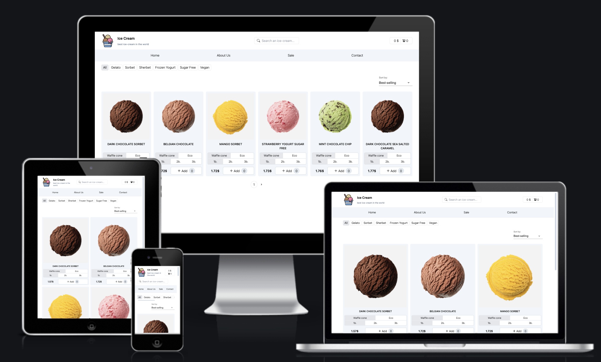

<h1>Simple Ice-Cream Store App made using React and mockAPI.</h1>

  
1. The products are loaded from [mockAPI](https://mockapi.io/docs) servers.
2. Products can be filtered by category:
   - _All, Gelato, Sorbet, Sherbet, Frozen Yogurt, No sugar, Vegan._
3. Products can be sorted by popularity, name and price.
4. Products can be searched using the search bar.
5. Pagination is implemented in the App.

**Demo:** https://anysofronova.github.io/react-ts-ice-cream-app/

